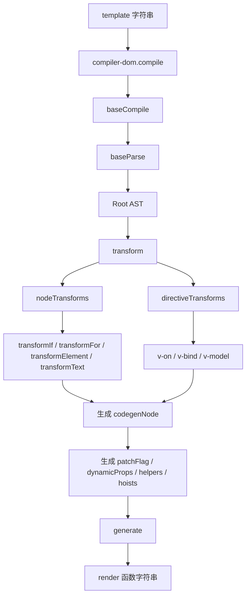
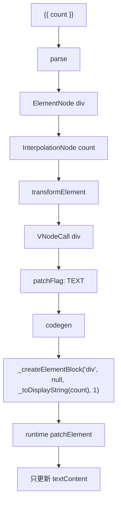
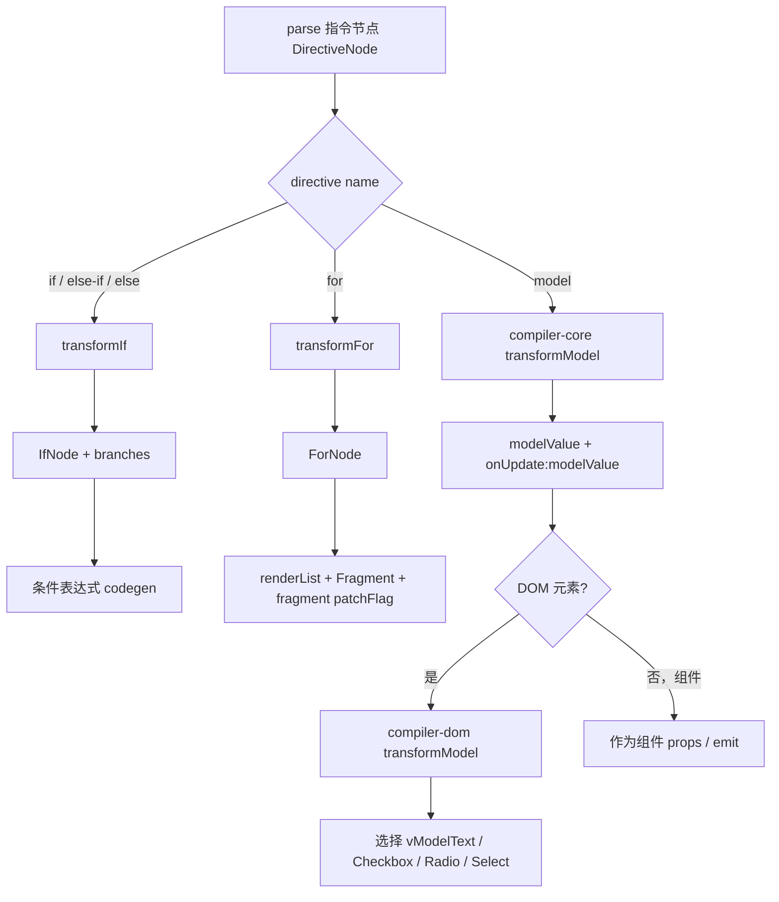

# Vue3 template 编译源码分析：模板如何变成 render 函数

本文基于当前仓库 `vue3` 源码整理，重点分析 Vue3 template 编译器如何把模板字符串转换成 render 函数：编译流程总览、parse / transform / codegen 三阶段、AST 节点结构、`v-if` / `v-for` / `v-model` 转换、`patchFlag` 生成、`hoistStatic` 静态提升，以及编译器如何帮助运行时优化。

## 一、涉及源码文件

| 文件 | 作用 |
| --- | --- |
| `vue3/packages/compiler-dom/src/index.ts` | DOM 编译器入口，注入 DOM 专属 parser / transform，然后调用 `baseCompile` |
| `vue3/packages/compiler-core/src/compile.ts` | 核心编译入口 `baseCompile`，串联 `baseParse -> transform -> generate` |
| `vue3/packages/compiler-core/src/parser.ts` | parse 阶段，把模板字符串解析成 AST |
| `vue3/packages/compiler-core/src/ast.ts` | AST 节点类型定义，例如 `RootNode`、`ElementNode`、`TextNode`、`InterpolationNode` |
| `vue3/packages/compiler-core/src/transform.ts` | transform 阶段入口，遍历 AST，执行 node/directive transforms，生成 codegenNode |
| `vue3/packages/compiler-core/src/codegen.ts` | codegen 阶段，把转换后的 AST 生成 render 函数字符串 |
| `vue3/packages/compiler-core/src/transforms/vIf.ts` | `v-if` / `v-else-if` / `v-else` 转换 |
| `vue3/packages/compiler-core/src/transforms/vFor.ts` | `v-for` 转换 |
| `vue3/packages/compiler-core/src/transforms/vModel.ts` | 平台无关的 `v-model` 转换，主要生成 `modelValue` 和 `onUpdate:modelValue` |
| `vue3/packages/compiler-dom/src/transforms/vModel.ts` | DOM 平台覆盖 `v-model`，选择 `vModelText` / `vModelCheckbox` / `vModelRadio` / `vModelSelect` 等运行时指令 |
| `vue3/packages/compiler-core/src/transforms/transformElement.ts` | 元素转换、VNodeCall 生成、props 分析、`patchFlag` 生成 |
| `vue3/packages/compiler-core/src/transforms/cacheStatic.ts` | 静态分析和静态缓存 / 提升 |
| `vue3/packages/compiler-core/src/transforms/transformText.ts` | 合并相邻文本，生成 `createTextVNode`，标记动态文本 |

## 二、编译流程总览

Vue3 编译器的核心流程是三段式：

```text
template string
  -> parse
     -> AST
  -> transform
     -> transformed AST + codegenNode + helpers + patchFlag + hoists
  -> codegen
     -> render function code string
```

DOM 平台入口在 `compiler-dom/src/index.ts`：

```ts
export function compile(
  src: string | RootNode,
  options: CompilerOptions = {},
): CodegenResult {
  return baseCompile(
    src,
    extend({}, parserOptions, options, {
      nodeTransforms: [
        ignoreSideEffectTags,
        ...DOMNodeTransforms,
        ...(options.nodeTransforms || []),
      ],
      directiveTransforms: extend(
        {},
        DOMDirectiveTransforms,
        options.directiveTransforms || {},
      ),
      transformHoist: __BROWSER__ ? null : stringifyStatic,
    }),
  )
}
```

核心编译入口在 `compiler-core/src/compile.ts`：

```ts
export function baseCompile(
  source: string | RootNode,
  options: CompilerOptions = {},
): CodegenResult {
  const resolvedOptions = extend({}, options, {
    prefixIdentifiers,
  })
  const ast = isString(source) ? baseParse(source, resolvedOptions) : source
  const [nodeTransforms, directiveTransforms] =
    getBaseTransformPreset(prefixIdentifiers)

  transform(
    ast,
    extend({}, resolvedOptions, {
      nodeTransforms: [
        ...nodeTransforms,
        ...(options.nodeTransforms || []),
      ],
      directiveTransforms: extend(
        {},
        directiveTransforms,
        options.directiveTransforms || {},
      ),
    }),
  )

  return generate(ast, resolvedOptions)
}
```

所以从源码看，编译器主线非常明确：

```text
baseCompile(source)
  -> baseParse(source)
  -> getBaseTransformPreset()
  -> transform(ast, transforms)
  -> generate(ast)
```

## 三、parse / transform / codegen 对比表

| 阶段 | 输入 | 输出 | 核心源码 | 主要职责 |
| --- | --- | --- | --- | --- |
| parse | template 字符串 | 原始 AST | `parser.ts` 的 `baseParse` | 词法 / 语法解析，识别元素、文本、插值、属性、指令 |
| transform | 原始 AST | 带 codegen 信息的 AST | `transform.ts` 的 `transform` | 遍历 AST，处理指令，转换表达式，生成 `codegenNode`，收集 helpers、components、directives、hoists |
| codegen | transformed AST | render 函数字符串 | `codegen.ts` 的 `generate` | 生成 JS 代码，输出 `function render(_ctx, _cache) { ... }` |

一句话：

```text
parse 负责“看懂模板”。
transform 负责“把模板语义变成运行时 vnode 创建语义”。
codegen 负责“把语义写成 JavaScript render 函数代码”。
```

## 四、parse 阶段做了什么？

parse 阶段入口：

```ts
export function baseParse(input: string, options?: ParserOptions): RootNode {
  reset()
  currentInput = input
  currentOptions = extend({}, defaultParserOptions)

  if (options) {
    for (key in options) {
      if (options[key] != null) {
        currentOptions[key] = options[key]
      }
    }
  }

  tokenizer.mode =
    currentOptions.parseMode === 'html'
      ? ParseMode.HTML
      : currentOptions.parseMode === 'sfc'
        ? ParseMode.SFC
        : ParseMode.BASE

  const root = (currentRoot = createRoot([], input))
  tokenizer.parse(currentInput)
  root.loc = getLoc(0, input.length)
  return root
}
```

parse 做的事情：

1. 初始化 parser 状态，例如 `currentInput`、`currentOptions`、`stack`。
2. 根据 `parseMode` 设置 tokenizer 模式。
3. 创建 root AST 节点。
4. 调用 tokenizer 解析模板字符串。
5. tokenizer 通过回调把文本、插值、标签、属性、指令转换为 AST 节点。

### 1. 文本节点

parser 的 tokenizer 回调：

```ts
ontext(start, end) {
  onText(getSlice(start, end), start, end)
}
```

文本最终会成为：

```ts
export interface TextNode extends Node {
  type: NodeTypes.TEXT
  content: string
}
```

例如：

```html
hello
```

对应：

```ts
{
  type: NodeTypes.TEXT,
  content: 'hello',
}
```

### 2. 插值节点

parser 识别 `{{ ... }}`：

```ts
oninterpolation(start, end) {
  let innerStart = start + tokenizer.delimiterOpen.length
  let innerEnd = end - tokenizer.delimiterClose.length

  while (isWhitespace(currentInput.charCodeAt(innerStart))) {
    innerStart++
  }
  while (isWhitespace(currentInput.charCodeAt(innerEnd - 1))) {
    innerEnd--
  }

  let exp = getSlice(innerStart, innerEnd)

  addNode({
    type: NodeTypes.INTERPOLATION,
    content: createExp(exp, false, getLoc(innerStart, innerEnd)),
    loc: getLoc(start, end),
  })
}
```

插值节点类型：

```ts
export interface InterpolationNode extends Node {
  type: NodeTypes.INTERPOLATION
  content: ExpressionNode
}
```

例如：

```html
{{ count }}
```

对应：

```ts
{
  type: NodeTypes.INTERPOLATION,
  content: {
    type: NodeTypes.SIMPLE_EXPRESSION,
    content: 'count',
    isStatic: false,
  },
}
```

### 3. 元素节点

打开标签时：

```ts
onopentagname(start, end) {
  const name = getSlice(start, end)
  currentOpenTag = {
    type: NodeTypes.ELEMENT,
    tag: name,
    ns: currentOptions.getNamespace(name, stack[0], currentOptions.ns),
    tagType: ElementTypes.ELEMENT,
    props: [],
    children: [],
    loc: getLoc(start - 1, end),
    codegenNode: undefined,
  }
}
```

元素节点基础类型：

```ts
export interface BaseElementNode extends Node {
  type: NodeTypes.ELEMENT
  ns: Namespace
  tag: string
  tagType: ElementTypes
  props: Array<AttributeNode | DirectiveNode>
  children: TemplateChildNode[]
  isSelfClosing?: boolean
  innerLoc?: SourceLocation
}
```

例如：

```html
<div id="app">{{ count }}</div>
```

会解析出：

```ts
{
  type: NodeTypes.ELEMENT,
  tag: 'div',
  tagType: ElementTypes.ELEMENT,
  props: [
    {
      type: NodeTypes.ATTRIBUTE,
      name: 'id',
      value: { type: NodeTypes.TEXT, content: 'app' },
    },
  ],
  children: [
    {
      type: NodeTypes.INTERPOLATION,
      content: { content: 'count' },
    },
  ],
}
```

### 4. 指令节点

解析指令名：

```ts
ondirname(start, end) {
  const raw = getSlice(start, end)
  const name =
    raw === '.' || raw === ':'
      ? 'bind'
      : raw === '@'
        ? 'on'
        : raw === '#'
          ? 'slot'
          : raw.slice(2)

  currentProp = {
    type: NodeTypes.DIRECTIVE,
    name,
    rawName: raw,
    exp: undefined,
    arg: undefined,
    modifiers: raw === '.' ? [createSimpleExpression('prop')] : [],
    loc: getLoc(start),
  }
}
```

解析指令表达式：

```ts
currentProp.exp = createExp(
  currentAttrValue,
  false,
  getLoc(currentAttrStartIndex, currentAttrEndIndex),
  ConstantTypes.NOT_CONSTANT,
  expParseMode,
)
if (currentProp.name === 'for') {
  currentProp.forParseResult = parseForExpression(currentProp.exp)
}
```

指令节点类型：

```ts
export interface DirectiveNode extends Node {
  type: NodeTypes.DIRECTIVE
  name: string
  rawName?: string
  exp: ExpressionNode | undefined
  arg: ExpressionNode | undefined
  modifiers: SimpleExpressionNode[]
  forParseResult?: ForParseResult
}
```

例如：

```html
<div v-if="ok" :class="cls" @click="onClick" />
```

会得到三个指令：

```text
v-if     -> name: 'if', exp: 'ok'
:class   -> name: 'bind', arg: 'class', exp: 'cls'
@click   -> name: 'on', arg: 'click', exp: 'onClick'
```

## 五、AST 是什么？

AST 是 Abstract Syntax Tree，抽象语法树。它是模板语法的结构化表示。

模板：

```html
<div id="app">hello {{ name }}</div>
```

在 parse 后会变成类似：

```ts
{
  type: NodeTypes.ROOT,
  source: '<div id="app">hello {{ name }}</div>',
  children: [
    {
      type: NodeTypes.ELEMENT,
      tag: 'div',
      props: [
        {
          type: NodeTypes.ATTRIBUTE,
          name: 'id',
          value: {
            type: NodeTypes.TEXT,
            content: 'app',
          },
        },
      ],
      children: [
        {
          type: NodeTypes.TEXT,
          content: 'hello ',
        },
        {
          type: NodeTypes.INTERPOLATION,
          content: {
            type: NodeTypes.SIMPLE_EXPRESSION,
            content: 'name',
            isStatic: false,
          },
        },
      ],
    },
  ],
  helpers: Set(),
  components: [],
  directives: [],
  hoists: [],
  cached: [],
}
```

AST 的作用：

1. 让编译器不再直接处理字符串，而是处理结构化节点。
2. 让 transform 阶段可以按节点类型做转换。
3. 让 codegen 阶段可以根据 `codegenNode` 生成 render 函数。

## 六、ElementNode、TextNode、InterpolationNode 分别是什么？

| 节点 | NodeTypes | 代表模板 | 关键字段 |
| --- | --- | --- | --- |
| `ElementNode` | `ELEMENT` | `<div />`、`<MyComp />` | `tag`、`tagType`、`props`、`children`、`codegenNode` |
| `TextNode` | `TEXT` | `hello` | `content` |
| `InterpolationNode` | `INTERPOLATION` | `{{ count }}` | `content: ExpressionNode` |

### ElementNode

源码：

```ts
export interface BaseElementNode extends Node {
  type: NodeTypes.ELEMENT
  ns: Namespace
  tag: string
  tagType: ElementTypes
  props: Array<AttributeNode | DirectiveNode>
  children: TemplateChildNode[]
  isSelfClosing?: boolean
  innerLoc?: SourceLocation
}
```

元素节点在 transform 后通常会有 `codegenNode`：

```ts
export interface PlainElementNode extends BaseElementNode {
  tagType: ElementTypes.ELEMENT
  codegenNode:
    | VNodeCall
    | SimpleExpressionNode
    | CacheExpression
    | MemoExpression
    | undefined
}
```

### TextNode

源码：

```ts
export interface TextNode extends Node {
  type: NodeTypes.TEXT
  content: string
}
```

### InterpolationNode

源码：

```ts
export interface InterpolationNode extends Node {
  type: NodeTypes.INTERPOLATION
  content: ExpressionNode
}
```

插值最终会在 codegen 中生成类似：

```ts
_toDisplayString(count)
```

## 七、transform 阶段做了什么？

transform 阶段入口：

```ts
export function transform(root: RootNode, options: TransformOptions): void {
  const context = createTransformContext(root, options)
  traverseNode(root, context)
  if (options.hoistStatic) {
    cacheStatic(root, context)
  }
  if (!options.ssr) {
    createRootCodegen(root, context)
  }

  root.helpers = new Set([...context.helpers.keys()])
  root.components = [...context.components]
  root.directives = [...context.directives]
  root.imports = context.imports
  root.hoists = context.hoists
  root.temps = context.temps
  root.cached = context.cached
  root.transformed = true
}
```

transform 做的事情：

1. 创建 `TransformContext`，用于记录 helpers、components、directives、hoists、scopes 等。
2. 遍历 AST 节点。
3. 执行 node transforms，例如 `transformIf`、`transformFor`、`transformElement`、`transformText`。
4. 执行 directive transforms，例如 `v-on`、`v-bind`、`v-model`。
5. 为节点生成 `codegenNode`。
6. 如果启用 `hoistStatic`，执行 `cacheStatic`。
7. 为 root 创建最终 `root.codegenNode`。
8. 把 transform 上下文里的元信息回填到 root。

基础 transform preset：

```ts
export function getBaseTransformPreset(
  prefixIdentifiers?: boolean,
): TransformPreset {
  return [
    [
      transformVBindShorthand,
      transformOnce,
      transformIf,
      transformMemo,
      transformFor,
      transformExpression,
      transformSlotOutlet,
      transformElement,
      trackSlotScopes,
      transformText,
    ],
    {
      on: transformOn,
      bind: transformBind,
      model: transformModel,
    },
  ]
}
```

DOM 编译器会额外注入 DOM 专属 transforms：

```ts
export const DOMNodeTransforms: NodeTransform[] = [
  transformStyle,
  transformTransition,
  validateHtmlNesting,
]

export const DOMDirectiveTransforms = {
  cloak: noopDirectiveTransform,
  html: transformVHtml,
  text: transformVText,
  model: transformModel,
  on: transformOn,
  show: transformShow,
}
```

## 八、codegen 阶段做了什么？

codegen 入口：

```ts
export function generate(
  ast: RootNode,
  options: CodegenOptions = {},
): CodegenResult {
  const context = createCodegenContext(ast, options)
  const helpers = Array.from(ast.helpers)
  const useWithBlock = !prefixIdentifiers && mode !== 'module'

  if (!__BROWSER__ && mode === 'module') {
    genModulePreamble(ast, preambleContext, genScopeId, isSetupInlined)
  } else {
    genFunctionPreamble(ast, preambleContext)
  }

  const functionName = ssr ? `ssrRender` : `render`
  const args = ssr ? ['_ctx', '_push', '_parent', '_attrs'] : ['_ctx', '_cache']

  push(`function ${functionName}(${signature}) {`)

  if (useWithBlock) {
    push(`with (_ctx) {`)
    if (hasHelpers) {
      push(`const { ${helpers.map(aliasHelper).join(', ')} } = _Vue\n`)
    }
  }

  push(`return `)
  if (ast.codegenNode) {
    genNode(ast.codegenNode, context)
  } else {
    push(`null`)
  }

  push(`}`)

  return {
    ast,
    code: context.code,
    preamble: isSetupInlined ? preambleContext.code : ``,
    map: context.map ? context.map.toJSON() : undefined,
  }
}
```

codegen 做的事情：

1. 生成 helper 导入或 helper 解构。
2. 生成 hoisted 常量。
3. 生成 render 函数签名。
4. 根据 `ast.codegenNode` 递归生成 vnode 创建代码。
5. 返回 `{ ast, code, preamble, map }`。

`generate` 的核心输出是：

```ts
function render(_ctx, _cache) {
  // helpers
  return ...
}
```

## 九、template 到 render 的转换示例

模板：

```vue
<template>
  <div class="box">{{ count }}</div>
</template>
```

parse 后核心 AST 大致是：

```ts
RootNode {
  children: [
    ElementNode {
      tag: 'div',
      props: [
        AttributeNode {
          name: 'class',
          value: TextNode { content: 'box' },
        },
      ],
      children: [
        InterpolationNode {
          content: SimpleExpressionNode { content: 'count' },
        },
      ],
    },
  ],
}
```

transform 后：

```text
ElementNode.codegenNode = VNodeCall {
  tag: "div",
  props: { class: "box" },
  children: InterpolationNode(count),
  patchFlag: PatchFlags.TEXT
}
```

codegen 后 render 大致是：

```ts
const _Vue = Vue

return function render(_ctx, _cache) {
  with (_ctx) {
    const { toDisplayString: _toDisplayString, openBlock: _openBlock, createElementBlock: _createElementBlock } = _Vue

    return (_openBlock(), _createElementBlock(
      "div",
      { class: "box" },
      _toDisplayString(count),
      1 /* TEXT */
    ))
  }
}
```

关键点：

```text
{{ count }}
  -> InterpolationNode
  -> _toDisplayString(count)
  -> PatchFlags.TEXT
```

运行时更新时，`patchElement` 看到 `TEXT` patchFlag，就可以只更新文本：

```ts
if (patchFlag & PatchFlags.TEXT) {
  if (n1.children !== n2.children) {
    hostSetElementText(el, n2.children as string)
  }
}
```

这就是编译器帮助运行时优化的一个典型例子。

## 十、v-if 是如何被转换的？

`v-if` 转换入口在 `vIf.ts`：

```ts
export const transformIf: NodeTransform = createStructuralDirectiveTransform(
  /^(?:if|else|else-if)$/,
  (node, dir, context) => {
    return processIf(node, dir, context, (ifNode, branch, isRoot) => {
      return () => {
        if (isRoot) {
          ifNode.codegenNode = createCodegenNodeForBranch(
            branch,
            key,
            context,
          )
        } else {
          const parentCondition = getParentCondition(ifNode.codegenNode!)
          parentCondition.alternate = createCodegenNodeForBranch(...)
        }
      }
    })
  },
)
```

`processIf` 会把普通元素替换成 `IfNode`：

```ts
if (dir.name === 'if') {
  const branch = createIfBranch(node, dir)
  const ifNode: IfNode = {
    type: NodeTypes.IF,
    loc: cloneLoc(node.loc),
    branches: [branch],
  }
  context.replaceNode(ifNode)
  return processCodegen(ifNode, branch, true)
}
```

例如：

```vue
<p v-if="ok">yes</p>
<p v-else>no</p>
```

parse 后是两个相邻元素节点，各自带 `v-if` / `v-else` 指令。

transform 后会变成一个 `IfNode`：

```ts
{
  type: NodeTypes.IF,
  branches: [
    {
      type: NodeTypes.IF_BRANCH,
      condition: SimpleExpressionNode('ok'),
      children: [ElementNode('p')],
    },
    {
      type: NodeTypes.IF_BRANCH,
      condition: undefined,
      children: [ElementNode('p')],
    },
  ],
  codegenNode: ConditionalExpression,
}
```

codegen 后大致：

```ts
ok
  ? (_openBlock(), _createElementBlock("p", { key: 0 }, "yes"))
  : (_openBlock(), _createElementBlock("p", { key: 1 }, "no"))
```

核心结论：

```text
v-if 把模板结构转换为条件表达式。
每个 branch 会生成自己的 vnode/block。
不同分支会注入 key，帮助运行时区分不同分支节点。
```

## 十一、v-for 是如何被转换的？

`v-for` 转换入口在 `vFor.ts`：

```ts
export const transformFor: NodeTransform = createStructuralDirectiveTransform(
  'for',
  (node, dir, context) => {
    return processFor(node, dir, context, forNode => {
      const renderExp = createCallExpression(helper(RENDER_LIST), [
        forNode.source,
      ])

      const fragmentFlag = isStableFragment
        ? PatchFlags.STABLE_FRAGMENT
        : keyProp
          ? PatchFlags.KEYED_FRAGMENT
          : PatchFlags.UNKEYED_FRAGMENT

      forNode.codegenNode = createVNodeCall(
        context,
        helper(FRAGMENT),
        undefined,
        renderExp,
        fragmentFlag,
        undefined,
        undefined,
        true,
        !isStableFragment,
        false,
        node.loc,
      )
    })
  },
)
```

`processFor` 会把元素替换成 `ForNode`：

```ts
const forNode: ForNode = {
  type: NodeTypes.FOR,
  loc: dir.loc,
  source,
  valueAlias: value,
  keyAlias: key,
  objectIndexAlias: index,
  parseResult,
  children: isTemplateNode(node) ? node.children : [node],
}

context.replaceNode(forNode)
```

例如：

```vue
<li v-for="item in list" :key="item.id">{{ item.name }}</li>
```

会转换为类似：

```ts
ForNode {
  source: SimpleExpressionNode('list'),
  valueAlias: SimpleExpressionNode('item'),
  children: [ElementNode('li')],
  codegenNode: VNodeCall(Fragment, renderList(list, item => ...), KEYED_FRAGMENT)
}
```

codegen 后大致：

```ts
(_openBlock(true), _createElementBlock(
  _Fragment,
  null,
  _renderList(list, (item) => {
    return (_openBlock(), _createElementBlock(
      "li",
      { key: item.id },
      _toDisplayString(item.name),
      1 /* TEXT */
    ))
  }),
  128 /* KEYED_FRAGMENT */
))
```

`v-for` 的 patchFlag 选择：

| 条件 | fragmentFlag |
| --- | --- |
| source 是稳定常量 | `STABLE_FRAGMENT` |
| 有 key | `KEYED_FRAGMENT` |
| 没有 key | `UNKEYED_FRAGMENT` |

这会直接影响运行时 `patchChildren` 选择：

```text
KEYED_FRAGMENT   -> patchKeyedChildren
UNKEYED_FRAGMENT -> patchUnkeyedChildren
STABLE_FRAGMENT  -> 稳定片段优化路径
```

## 十二、v-model 是如何被转换的？

`v-model` 分两层：

1. `compiler-core` 处理平台无关语义。
2. `compiler-dom` 根据 DOM 元素类型选择运行时指令。

### 1. compiler-core 的 v-model

核心转换在 `compiler-core/src/transforms/vModel.ts`：

```ts
const propName = arg ? arg : createSimpleExpression('modelValue', true)
const eventName = arg
  ? isStaticExp(arg)
    ? `onUpdate:${camelize(arg.content)}`
    : createCompoundExpression(['"onUpdate:" + ', arg])
  : `onUpdate:modelValue`

const props = [
  createObjectProperty(propName, dir.exp!),
  createObjectProperty(eventName, assignmentExp),
]
```

对于组件：

```vue
<MyInput v-model="title" />
```

会生成类似 props：

```ts
{
  modelValue: title,
  "onUpdate:modelValue": $event => (title = $event)
}
```

对于带参数的组件 v-model：

```vue
<MyInput v-model:title="title" />
```

会生成：

```ts
{
  title: title,
  "onUpdate:title": $event => (title = $event)
}
```

### 2. compiler-dom 的 v-model

DOM 平台覆盖了 core 的 `transformModel`：

```ts
export const DOMDirectiveTransforms = {
  model: transformModel, // override compiler-core
}
```

DOM 版本会先调用 core transform：

```ts
const baseResult = baseTransform(dir, node, context)
```

然后根据标签和 type 选择运行时指令：

```ts
let directiveToUse = V_MODEL_TEXT
if (tag === 'input' || isCustomElement) {
  const type = findProp(node, `type`)
  if (type) {
    if (type.type === NodeTypes.DIRECTIVE) {
      directiveToUse = V_MODEL_DYNAMIC
    } else if (type.value) {
      switch (type.value.content) {
        case 'radio':
          directiveToUse = V_MODEL_RADIO
          break
        case 'checkbox':
          directiveToUse = V_MODEL_CHECKBOX
          break
      }
    }
  }
} else if (tag === 'select') {
  directiveToUse = V_MODEL_SELECT
}

baseResult.needRuntime = context.helper(directiveToUse)
```

并且 DOM 原生 `v-model` 会移除 `modelValue` prop：

```ts
baseResult.props = baseResult.props.filter(
  p =>
    !(
      p.key.type === NodeTypes.SIMPLE_EXPRESSION &&
      p.key.content === 'modelValue'
    ),
)
```

因为原生元素的 `v-model` 值会作为 runtime directive 的 `binding.value` 传入，不需要再作为普通 prop 传递。

示例：

```vue
<input v-model="msg" />
```

大致会生成：

```ts
_withDirectives(
  _createElementVNode("input", {
    "onUpdate:modelValue": $event => (msg = $event)
  }),
  [[_vModelText, msg]]
)
```

## 十三、patchFlag 是如何在编译阶段生成的？

`patchFlag` 的主要生成位置在 `transformElement.ts`。

### 1. 动态文本生成 TEXT

如果元素只有一个动态文本子节点：

```ts
const hasDynamicTextChild =
  type === NodeTypes.INTERPOLATION ||
  type === NodeTypes.COMPOUND_EXPRESSION
if (
  hasDynamicTextChild &&
  getConstantType(child, context) === ConstantTypes.NOT_CONSTANT
) {
  patchFlag |= PatchFlags.TEXT
}
```

示例：

```vue
<div>{{ count }}</div>
```

生成：

```text
PatchFlags.TEXT
```

运行时只更新 textContent。

### 2. 动态 props 生成 CLASS / STYLE / PROPS / FULL_PROPS

`buildProps` 里做 props 的 patchFlag 分析：

```ts
if (hasDynamicKeys) {
  patchFlag |= PatchFlags.FULL_PROPS
} else {
  if (hasClassBinding && !isComponent) {
    patchFlag |= PatchFlags.CLASS
  }
  if (hasStyleBinding && !isComponent) {
    patchFlag |= PatchFlags.STYLE
  }
  if (dynamicPropNames.length) {
    patchFlag |= PatchFlags.PROPS
  }
  if (hasHydrationEventBinding) {
    patchFlag |= PatchFlags.NEED_HYDRATION
  }
}
```

示例：

```vue
<div :class="cls" :id="id" />
```

可能生成：

```text
PatchFlags.CLASS | PatchFlags.PROPS
dynamicProps = ["id"]
```

### 3. v-for fragment 生成 KEYED / UNKEYED / STABLE

`v-for` 中：

```ts
const fragmentFlag = isStableFragment
  ? PatchFlags.STABLE_FRAGMENT
  : keyProp
    ? PatchFlags.KEYED_FRAGMENT
    : PatchFlags.UNKEYED_FRAGMENT
```

示例：

```vue
<li v-for="item in list" :key="item.id">{{ item.name }}</li>
```

生成：

```text
PatchFlags.KEYED_FRAGMENT
```

### 4. 需要强制 patch 的节点生成 NEED_PATCH

当节点本身没有其他动态 patchFlag，但存在 ref、vnode hook 或 runtime directive：

```ts
if (
  !shouldUseBlock &&
  (patchFlag === 0 || patchFlag === PatchFlags.NEED_HYDRATION) &&
  (hasRef || hasVnodeHook || runtimeDirectives.length > 0)
) {
  patchFlag |= PatchFlags.NEED_PATCH
}
```

例如有自定义指令时，即便 props 静态，也可能需要运行时 patch 钩子。

## 十四、hoistStatic 静态提升是什么？

`hoistStatic` 是编译期静态分析和缓存优化。

transform 阶段：

```ts
if (options.hoistStatic) {
  cacheStatic(root, context)
}
```

`cacheStatic` 会遍历 AST：

```ts
export function cacheStatic(root: RootNode, context: TransformContext): void {
  walk(
    root,
    undefined,
    context,
    !!getSingleElementRoot(root),
  )
}
```

它会判断节点的常量等级：

```ts
export enum ConstantTypes {
  NOT_CONSTANT = 0,
  CAN_SKIP_PATCH,
  CAN_CACHE,
  CAN_STRINGIFY,
}
```

静态等级含义：

| ConstantTypes | 含义 |
| --- | --- |
| `NOT_CONSTANT` | 动态内容，不能静态缓存 |
| `CAN_SKIP_PATCH` | 可跳过 patch |
| `CAN_CACHE` | 可以缓存为 hoisted / cached 表达式 |
| `CAN_STRINGIFY` | 可字符串化，静态程度最高 |

`cacheStatic` 里对静态节点的处理：

```ts
if (constantType > ConstantTypes.NOT_CONSTANT) {
  if (constantType >= ConstantTypes.CAN_CACHE) {
    ;(child.codegenNode as VNodeCall).patchFlag = PatchFlags.CACHED
    toCache.push(child)
    continue
  }
}
```

对可缓存节点：

```ts
for (const child of toCache) {
  child.codegenNode = context.cache(child.codegenNode!)
}
```

对可提升 props：

```ts
if (getGeneratedPropsConstantType(child, context) >= ConstantTypes.CAN_CACHE) {
  const props = getNodeProps(child)
  if (props) {
    codegenNode.props = context.hoist(props)
  }
}
```

codegen 会生成 hoisted 常量：

```ts
function genHoists(hoists, context) {
  for (let i = 0; i < hoists.length; i++) {
    const exp = hoists[i]
    if (exp) {
      push(`const _hoisted_${i + 1} = `)
      genNode(exp, context)
      newline()
    }
  }
}
```

当前版本细节：

```text
Vue 3.5+ 注释中说明不再需要旧式“hoist element nodes”的某些 helper。
但静态缓存 / props 提升 / 动态 props 提升 / children array 缓存仍然存在。
```

示例：

```vue
<div>
  <p class="tip">static</p>
  <p>{{ msg }}</p>
</div>
```

静态部分可以被缓存或提升，动态部分保留 patchFlag：

```text
<p class="tip">static</p> -> 可缓存 / 可跳过重复 patch
<p>{{ msg }}</p>          -> PatchFlags.TEXT
```

## 十五、编译器如何帮助运行时优化？

编译器为运行时提供了大量“提示信息”，使运行时不必盲目全量 diff。

| 编译产物 | 运行时收益 |
| --- | --- |
| `patchFlag` | 运行时知道只更新 text、class、style、props，避免全量 props/children diff |
| `dynamicProps` | `PatchFlags.PROPS` 时只遍历动态 prop 名称 |
| `dynamicChildren` / block tree | 运行时只 patch block 中动态节点 |
| `KEYED_FRAGMENT` / `UNKEYED_FRAGMENT` | `patchChildren` 直接选择 keyed 或 unkeyed diff |
| `hoists` / `cached` | 静态内容复用，减少 vnode 创建和 patch 成本 |
| `helpers` | render 函数只引入实际需要的运行时 helper |
| `codegenNode` | transform 后直接生成高效 vnode 创建代码 |

以动态文本为例：

```vue
<div>{{ count }}</div>
```

编译器生成：

```ts
_createElementBlock("div", null, _toDisplayString(count), 1 /* TEXT */)
```

运行时 `patchElement` 看到 `TEXT`：

```ts
if (patchFlag & PatchFlags.TEXT) {
  hostSetElementText(el, n2.children as string)
}
```

这比运行时重新比较 props、children、子树结构更快。

## 十六、Mermaid：编译流程总览



## 十七、Mermaid：template 到 render



## 十八、Mermaid：指令转换



## 十九、写出示例代码

### 1. 在 Node 中使用 compiler-dom

```ts
import { compile } from '@vue/compiler-dom'

const result = compile(`<div class="box">{{ count }}</div>`, {
  mode: 'function',
  hoistStatic: true,
})

console.log(result.code)
```

输出大致：

```ts
const _Vue = Vue

return function render(_ctx, _cache) {
  with (_ctx) {
    const { toDisplayString: _toDisplayString, openBlock: _openBlock, createElementBlock: _createElementBlock } = _Vue

    return (_openBlock(), _createElementBlock(
      "div",
      { class: "box" },
      _toDisplayString(count),
      1 /* TEXT */
    ))
  }
}
```

### 2. v-if 编译示例

模板：

```vue
<p v-if="ok">yes</p>
<p v-else>no</p>
```

render 大致：

```ts
return ok
  ? (_openBlock(), _createElementBlock("p", { key: 0 }, "yes"))
  : (_openBlock(), _createElementBlock("p", { key: 1 }, "no"))
```

### 3. v-for 编译示例

模板：

```vue
<li v-for="item in list" :key="item.id">{{ item.name }}</li>
```

render 大致：

```ts
return (_openBlock(true), _createElementBlock(
  _Fragment,
  null,
  _renderList(list, item => {
    return (_openBlock(), _createElementBlock(
      "li",
      { key: item.id },
      _toDisplayString(item.name),
      1 /* TEXT */
    ))
  }),
  128 /* KEYED_FRAGMENT */
))
```

### 4. v-model 编译示例

组件：

```vue
<MyInput v-model="title" />
```

大致生成：

```ts
_createVNode(_component_MyInput, {
  modelValue: title,
  "onUpdate:modelValue": $event => (title = $event)
})
```

DOM input：

```vue
<input v-model="msg" />
```

大致生成：

```ts
_withDirectives(
  _createElementVNode("input", {
    "onUpdate:modelValue": $event => (msg = $event)
  }),
  [[_vModelText, msg]]
)
```

## 二十、核心结论

1. Vue3 template 编译器整体分为 parse、transform、codegen 三阶段。
2. DOM 编译入口是 `compiler-dom.compile`，核心编译入口是 `compiler-core.baseCompile`。
3. parse 阶段把模板字符串解析成 AST，识别元素、文本、插值、属性和指令。
4. AST 是模板的结构化表示，核心节点包括 `ElementNode`、`TextNode`、`InterpolationNode`。
5. transform 阶段遍历 AST，执行 `transformIf`、`transformFor`、`transformElement`、`transformText` 等转换。
6. `v-if` 会被转换成 `IfNode` 和条件表达式 codegen。
7. `v-for` 会被转换成 `ForNode`，并生成 `renderList`、`Fragment` 以及 `KEYED_FRAGMENT` / `UNKEYED_FRAGMENT` 等 patchFlag。
8. `v-model` 在 core 层生成 `modelValue` 和 `onUpdate:modelValue`，在 DOM 层选择对应 runtime directive。
9. `patchFlag` 主要在 `transformElement` 和 `buildProps` 中生成，例如 `TEXT`、`CLASS`、`STYLE`、`PROPS`、`FULL_PROPS`。
10. `hoistStatic` 会通过 `cacheStatic` 做静态分析，缓存静态 vnode/text call，提升静态 props 或 dynamicProps。
11. codegen 阶段根据 transformed AST 生成 render 函数字符串。
12. 编译器通过 `patchFlag`、`dynamicProps`、block tree、hoists、cached 等信息帮助运行时跳过无意义 diff，实现更精确的更新。

