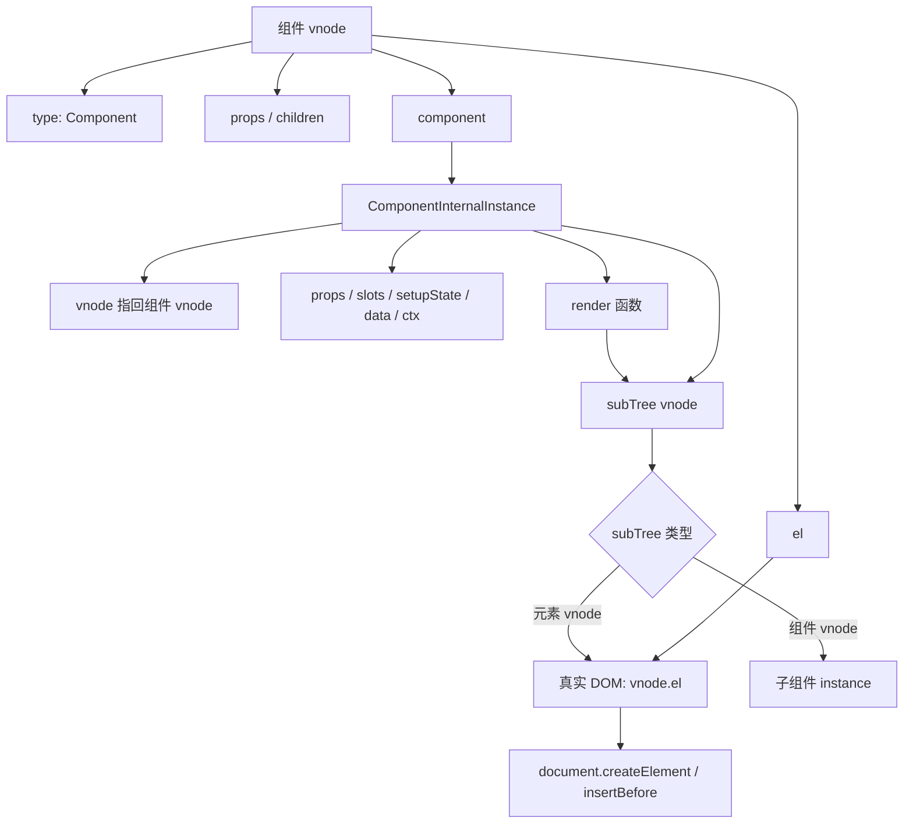
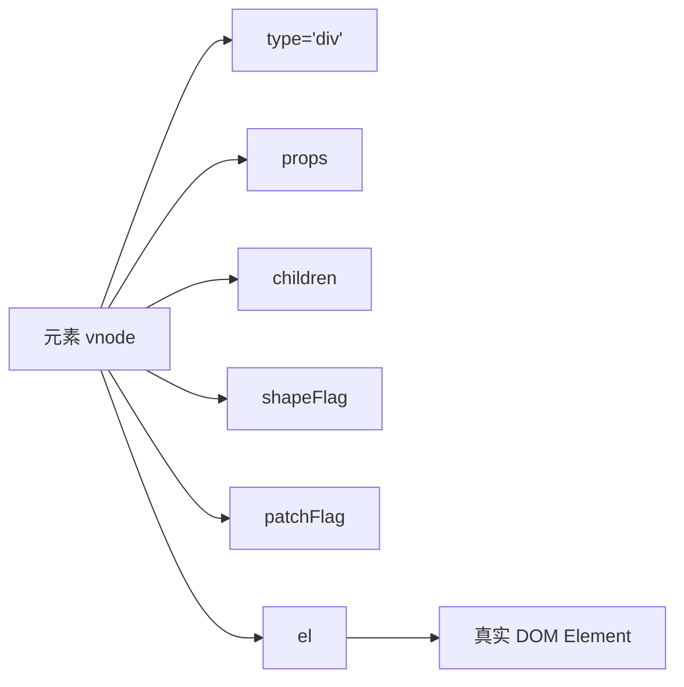

# Vue3 vnode 源码实现分析

本文基于当前仓库 `vue3` 源码整理，重点分析 vnode 是什么、`createVNode` 和 `h` 的关系、vnode 核心字段、`shapeFlag`、`patchFlag`、`dynamicChildren`，以及 vnode 与真实 DOM、组件实例之间的关系。

## 一、涉及源码文件

| 文件 | 作用 |
| --- | --- |
| `vue3/packages/runtime-core/src/vnode.ts` | vnode 类型定义、`createVNode`、`createBaseVNode`、`normalizeChildren`、block/dynamicChildren |
| `vue3/packages/runtime-core/src/h.ts` | 用户手写 render 函数常用的 `h()`，内部调用 `createVNode` |
| `vue3/packages/shared/src/shapeFlags.ts` | `ShapeFlags` 位标记定义 |
| `vue3/packages/shared/src/patchFlags.ts` | `PatchFlags` 编译器优化标记定义 |
| `vue3/packages/runtime-core/src/renderer.ts` | `patch` 根据 vnode 类型分发，挂载元素时写入 `vnode.el`，挂载组件时写入 `vnode.component` |

## 二、vnode 是什么？

vnode 是 Virtual Node，虚拟节点。它是 Vue 用来描述 UI 的普通 JavaScript 对象。

真实 DOM 是浏览器里的节点：

```html
<div id="app">hello</div>
```

vnode 则是 Vue 内部对这棵 UI 的描述：

```ts
{
  type: 'div',
  props: { id: 'app' },
  children: 'hello',
  shapeFlag: ShapeFlags.ELEMENT | ShapeFlags.TEXT_CHILDREN,
  el: null,
}
```

vnode 的核心作用：

1. 描述节点类型：普通 DOM 元素、组件、Text、Comment、Fragment、Teleport、Suspense 等。
2. 描述节点属性：props、key、ref、class、style、事件等。
3. 描述子节点：文本、数组、slots。
4. 保存运行时连接：真实 DOM 存在 `vnode.el`，组件实例存在 `vnode.component`。
5. 提供更新优化信息：`shapeFlag`、`patchFlag`、`dynamicProps`、`dynamicChildren`。

一句话：vnode 是 Vue renderer 的输入，patch 根据新旧 vnode 的差异决定如何创建、更新或移除真实 DOM 和组件实例。

## 三、createVNode 的入口在哪里？

`createVNode` 的入口在 `packages/runtime-core/src/vnode.ts`：

```ts
export const createVNode = (
  __DEV__ ? createVNodeWithArgsTransform : _createVNode
) as typeof _createVNode
```

真正创建逻辑在 `_createVNode`：

```ts
function _createVNode(
  type,
  props = null,
  children = null,
  patchFlag = 0,
  dynamicProps = null,
  isBlockNode = false,
): VNode {
  if (!type || type === NULL_DYNAMIC_COMPONENT) {
    type = Comment
  }

  if (isVNode(type)) {
    const cloned = cloneVNode(type, props, true)
    if (children) {
      normalizeChildren(cloned, children)
    }
    cloned.patchFlag = PatchFlags.BAIL
    return cloned
  }

  if (isClassComponent(type)) {
    type = type.__vccOpts
  }

  if (props) {
    props = guardReactiveProps(props)!
    // normalize class/style
  }

  const shapeFlag = isString(type)
    ? ShapeFlags.ELEMENT
    : isObject(type)
      ? ShapeFlags.STATEFUL_COMPONENT
      : isFunction(type)
        ? ShapeFlags.FUNCTIONAL_COMPONENT
        : 0

  return createBaseVNode(
    type,
    props,
    children,
    patchFlag,
    dynamicProps,
    shapeFlag,
    isBlockNode,
    true,
  )
}
```

`createBaseVNode` 创建最终 vnode 对象：

```ts
function createBaseVNode(
  type,
  props = null,
  children = null,
  patchFlag = 0,
  dynamicProps = null,
  shapeFlag = type === Fragment ? 0 : ShapeFlags.ELEMENT,
  isBlockNode = false,
  needFullChildrenNormalization = false,
): VNode {
  const vnode = {
    __v_isVNode: true,
    __v_skip: true,
    type,
    props,
    key: props && normalizeKey(props),
    ref: props && normalizeRef(props),
    scopeId: currentScopeId,
    slotScopeIds: null,
    children,
    component: null,
    suspense: null,
    ssContent: null,
    ssFallback: null,
    dirs: null,
    transition: null,
    el: null,
    anchor: null,
    target: null,
    targetStart: null,
    targetAnchor: null,
    staticCount: 0,
    shapeFlag,
    patchFlag,
    dynamicProps,
    dynamicChildren: null,
    appContext: null,
    ctx: currentRenderingInstance,
  }

  if (needFullChildrenNormalization) {
    normalizeChildren(vnode, children)
  } else if (children) {
    vnode.shapeFlag |= isString(children)
      ? ShapeFlags.TEXT_CHILDREN
      : ShapeFlags.ARRAY_CHILDREN
  }

  return vnode
}
```

## 四、createVNode 调用链

```text
createVNode(type, props, children, patchFlag, dynamicProps)
  -> _createVNode(...)
    -> 处理无效 type
    -> 如果 type 已经是 vnode，则 cloneVNode
    -> class component 转换成 __vccOpts
    -> props 规范化：clone reactive props，normalize class/style
    -> 根据 type 计算初始 shapeFlag
    -> createBaseVNode(...)
      -> 创建 vnode 普通对象
      -> normalizeKey / normalizeRef
      -> normalizeChildren
      -> 写入 shapeFlag / patchFlag / dynamicProps / dynamicChildren
      -> 必要时把动态 vnode 收集进 currentBlock
      -> 返回 vnode
```

常见来源：

```text
h(...)
  -> createVNode(...)

模板编译生成的 render
  -> createElementVNode / createVNode / createElementBlock

createApp(App).mount(...)
  -> createVNode(rootComponent, rootProps)
```

## 五、h 函数和 createVNode 是什么关系？

`h` 在 `packages/runtime-core/src/h.ts`。

源码注释直接说明了它和 `createVNode` 的关系：

```ts
// `h` is a more user-friendly version of `createVNode` that allows omitting the
// props when possible. It is intended for manually written render functions.
// Compiler-generated code uses `createVNode` because
// 1. it is monomorphic and avoids the extra call overhead
// 2. it allows specifying patchFlags for optimization
```

也就是说：

- `h()` 是给用户手写 render 函数用的友好 API。
- `createVNode()` 更底层，参数形态固定，模板编译生成的代码会直接用它或它的变体。
- `h()` 内部最终还是调用 `createVNode()`。

`h` 的实现会根据参数个数和参数类型做兼容：

```ts
export function h(type: any, propsOrChildren?: any, children?: any): VNode {
  try {
    setBlockTracking(-1)
    const l = arguments.length
    if (l === 2) {
      if (isObject(propsOrChildren) && !isArray(propsOrChildren)) {
        if (isVNode(propsOrChildren)) {
          return createVNode(type, null, [propsOrChildren])
        }
        return createVNode(type, propsOrChildren)
      } else {
        return createVNode(type, null, propsOrChildren)
      }
    } else {
      if (l > 3) {
        children = Array.prototype.slice.call(arguments, 2)
      } else if (l === 3 && isVNode(children)) {
        children = [children]
      }
      return createVNode(type, propsOrChildren, children)
    }
  } finally {
    setBlockTracking(1)
  }
}
```

示例：

```ts
h('div')
// -> createVNode('div')

h('div', { id: 'app' })
// -> createVNode('div', { id: 'app' })

h('div', 'hello')
// -> createVNode('div', null, 'hello')

h('div', null, [h('span', 'hello')])
// -> createVNode('div', null, [spanVNode])
```

## 六、vnode 数据结构表

`VNode` interface 位于 `vnode.ts`。核心字段如下：

| 字段 | 含义 |
| --- | --- |
| `__v_isVNode` | 标识当前对象是 vnode |
| `__v_skip` | 跳过响应式代理标记，避免 vnode 被 reactive 深度代理 |
| `type` | vnode 类型，可以是字符串标签、组件、Text、Comment、Fragment、Teleport、Suspense 等 |
| `props` | 节点属性、事件、class、style、key、ref、vnode hooks 等 |
| `key` | diff 时用于判断同层节点身份 |
| `ref` | 模板 ref 信息，挂载后会设置到 refs 或 ref 对象 |
| `scopeId` | SFC scoped CSS id |
| `slotScopeIds` | slot 场景下的 scoped CSS ids |
| `children` | 子节点，可以是字符串、vnode 数组、slots 对象或 null |
| `component` | 如果是组件 vnode，挂载后保存组件实例 |
| `dirs` | 指令绑定信息 |
| `transition` | transition hooks |
| `el` | 当前 vnode 对应的真实 DOM 节点 |
| `placeholder` | async component 占位节点 |
| `anchor` | Fragment 结束锚点 |
| `target` / `targetStart` / `targetAnchor` | Teleport 相关目标节点 |
| `staticCount` | static vnode 包含的节点数量 |
| `suspense` | Suspense 边界 |
| `ssContent` / `ssFallback` | Suspense 内容与 fallback vnode |
| `shapeFlag` | 描述 vnode 类型和 children 类型的位标记 |
| `patchFlag` | 编译器生成的更新优化标记 |
| `dynamicProps` | `PatchFlags.PROPS` 下需要快速更新的动态 prop key 数组 |
| `dynamicChildren` | block tree 中收集到的动态子节点数组 |
| `appContext` | 根 vnode 上保存 app 上下文 |
| `ctx` | 创建 vnode 时的当前渲染实例 |
| `memo` / `cacheIndex` | `v-memo` 相关缓存信息 |
| `ce` | custom element 拦截 hook |

## 七、type、props、children、key、ref 分别有什么作用？

### 1. type

`type` 决定 vnode 是什么类型。

常见值：

| type | 含义 |
| --- | --- |
| `'div'` | 普通 DOM 元素 |
| `Text` | 文本节点 |
| `Comment` | 注释节点 |
| `Fragment` | 多根片段 |
| `App` 对象 | 有状态组件 |
| 函数组件 | 函数组件 |
| `Teleport` | Teleport |
| `Suspense` | Suspense |

renderer 中 `patch` 会先看 `type`，再看 `shapeFlag`：

```ts
switch (type) {
  case Text:
    processText(...)
    break
  case Comment:
    processCommentNode(...)
    break
  case Fragment:
    processFragment(...)
    break
  default:
    if (shapeFlag & ShapeFlags.ELEMENT) {
      processElement(...)
    } else if (shapeFlag & ShapeFlags.COMPONENT) {
      processComponent(...)
    }
}
```

### 2. props

`props` 保存 vnode 属性。

对元素 vnode：

```ts
h('button', {
  id: 'submit',
  class: 'primary',
  onClick: handleClick,
})
```

这些 props 会在 `mountElement` 或 `patchElement` 中通过 `hostPatchProp` 更新到真实 DOM。

对组件 vnode：

```ts
h(MyButton, {
  title: 'Save',
  onClick: handleClick,
})
```

这些 props 会在组件初始化时通过 `initProps` 拆成 `instance.props` 和 `instance.attrs`。

### 3. children

`children` 描述子节点。

| children 类型 | 典型 vnode |
| --- | --- |
| 字符串 | 文本子节点 |
| vnode 数组 | 普通元素 children / Fragment children |
| slots 对象 | 组件插槽 |
| null | 无子节点 |

`normalizeChildren` 会根据 children 类型补充 `shapeFlag`：

```ts
if (isArray(children)) {
  type = ShapeFlags.ARRAY_CHILDREN
} else if (typeof children === 'object') {
  type = ShapeFlags.SLOTS_CHILDREN
} else {
  children = String(children)
  type = ShapeFlags.TEXT_CHILDREN
}
vnode.children = children
vnode.shapeFlag |= type
```

### 4. key

`key` 来自 `props.key`：

```ts
key: props && normalizeKey(props)
```

它用于同层 children diff 时判断节点身份，尤其是 keyed diff：

```vue
<li v-for="item in list" :key="item.id">
  {{ item.name }}
</li>
```

没有稳定 key 时，Vue 只能更多依赖位置进行复用；有 key 时，可以更准确地移动、复用或删除节点。

### 5. ref

`ref` 来自 `props.ref`，会被 `normalizeRef` 标准化。

支持：

```ts
type VNodeRef =
  | string
  | Ref
  | ((ref, refs) => void)
```

挂载或更新后，renderer 会根据 vnode.ref 设置模板 ref。组件 vnode 的 ref 通常指向组件 public instance；元素 vnode 的 ref 指向真实 DOM。

## 八、shapeFlag 是什么？

`shapeFlag` 是 vnode 形态标记，用位运算把“节点类型”和“children 类型”压缩到一个数字中。

定义在 `packages/shared/src/shapeFlags.ts`：

```ts
export enum ShapeFlags {
  ELEMENT = 1,
  FUNCTIONAL_COMPONENT = 1 << 1,
  STATEFUL_COMPONENT = 1 << 2,
  TEXT_CHILDREN = 1 << 3,
  ARRAY_CHILDREN = 1 << 4,
  SLOTS_CHILDREN = 1 << 5,
  TELEPORT = 1 << 6,
  SUSPENSE = 1 << 7,
  COMPONENT_SHOULD_KEEP_ALIVE = 1 << 8,
  COMPONENT_KEPT_ALIVE = 1 << 9,
  COMPONENT = ShapeFlags.STATEFUL_COMPONENT | ShapeFlags.FUNCTIONAL_COMPONENT,
}
```

### 位运算说明

每一项都是二进制中的一个 bit：

| 标记 | 十进制 | 二进制示意 | 含义 |
| --- | --- | --- | --- |
| `ELEMENT` | 1 | `0000000001` | 普通元素 |
| `FUNCTIONAL_COMPONENT` | 2 | `0000000010` | 函数组件 |
| `STATEFUL_COMPONENT` | 4 | `0000000100` | 有状态组件 |
| `TEXT_CHILDREN` | 8 | `0000001000` | 文本 children |
| `ARRAY_CHILDREN` | 16 | `0000010000` | 数组 children |
| `SLOTS_CHILDREN` | 32 | `0000100000` | slots children |
| `TELEPORT` | 64 | `0001000000` | Teleport |
| `SUSPENSE` | 128 | `0010000000` | Suspense |
| `COMPONENT` | 6 | `0000000110` | 函数组件或有状态组件 |

创建一个文本 children 的 div：

```ts
const vnode = createVNode('div', null, 'hello')
```

shapeFlag 大致是：

```text
ELEMENT | TEXT_CHILDREN
= 1 | 8
= 9
```

判断时用 `&`：

```ts
if (vnode.shapeFlag & ShapeFlags.ELEMENT) {
  // 是元素
}

if (vnode.shapeFlag & ShapeFlags.TEXT_CHILDREN) {
  // children 是文本
}
```

renderer 大量使用 `shapeFlag` 做快速分支：

```ts
if (shapeFlag & ShapeFlags.ELEMENT) {
  processElement(...)
} else if (shapeFlag & ShapeFlags.COMPONENT) {
  processComponent(...)
}
```

和：

```ts
if (shapeFlag & ShapeFlags.TEXT_CHILDREN) {
  hostSetElementText(el, vnode.children as string)
} else if (shapeFlag & ShapeFlags.ARRAY_CHILDREN) {
  mountChildren(...)
}
```

## 九、patchFlag 的作用

`patchFlag` 是编译器生成的更新优化提示，定义在 `packages/shared/src/patchFlags.ts`。

源码注释说明：

```ts
/**
 * Patch flags are optimization hints generated by the compiler.
 * when a block with dynamicChildren is encountered during diff, the algorithm
 * enters "optimized mode".
 */
```

常见 patchFlag：

| 标记 | 含义 |
| --- | --- |
| `TEXT` | 动态文本内容 |
| `CLASS` | 动态 class |
| `STYLE` | 动态 style |
| `PROPS` | 动态 props，具体 key 存在 `dynamicProps` |
| `FULL_PROPS` | 动态 key，需要完整 props diff |
| `NEED_HYDRATION` | hydration 需要处理 props |
| `STABLE_FRAGMENT` | 稳定顺序 fragment |
| `KEYED_FRAGMENT` | keyed children fragment |
| `UNKEYED_FRAGMENT` | unkeyed children fragment |
| `NEED_PATCH` | ref、指令或 vnode hook 等非 props patch |
| `DYNAMIC_SLOTS` | 动态 slots，组件需要强制更新 |
| `CACHED` | 缓存静态 vnode |
| `BAIL` | 退出优化模式，走完整 diff |

### patchFlag 如何加速更新？

没有 patchFlag 时，更新元素通常需要完整比较 props 和 children。

有 patchFlag 时，`patchElement` 可以精准更新：

```ts
if (patchFlag > 0) {
  if (patchFlag & PatchFlags.FULL_PROPS) {
    patchProps(el, oldProps, newProps, parentComponent, namespace)
  } else {
    if (patchFlag & PatchFlags.CLASS) {
      if (oldProps.class !== newProps.class) {
        hostPatchProp(el, 'class', null, newProps.class, namespace)
      }
    }

    if (patchFlag & PatchFlags.STYLE) {
      hostPatchProp(el, 'style', oldProps.style, newProps.style, namespace)
    }

    if (patchFlag & PatchFlags.PROPS) {
      const propsToUpdate = n2.dynamicProps!
      for (let i = 0; i < propsToUpdate.length; i++) {
        const key = propsToUpdate[i]
        hostPatchProp(el, key, prev, next, namespace, parentComponent)
      }
    }
  }

  if (patchFlag & PatchFlags.TEXT) {
    if (n1.children !== n2.children) {
      hostSetElementText(el, n2.children as string)
    }
  }
}
```

示例：

```vue
<div :class="cls">{{ msg }}</div>
```

编译器知道只有 class 和 text 是动态的，于是可以生成类似：

```text
patchFlag = CLASS | TEXT
```

更新时 Vue 不需要重新 diff 所有 props，只需要检查 class 和 text。

## 十、dynamicChildren 是什么？

`dynamicChildren` 是 block tree 优化的核心字段。

源码注释解释了 block 的目的：

```ts
// Since v-if and v-for are the two possible ways node structure can dynamically
// change, once we consider v-if branches and each v-for fragment a block, we
// can divide a template into nested blocks, and within each block the node
// structure would be stable. This allows us to skip most children diffing
// and only worry about the dynamic nodes (indicated by patch flags).
```

编译器生成 render 时会使用：

```ts
openBlock()
createElementBlock(...)
```

`openBlock()` 创建当前 block 的动态节点收集数组：

```ts
export function openBlock(disableTracking = false): void {
  blockStack.push((currentBlock = disableTracking ? null : []))
}
```

`setupBlock(vnode)` 把当前 block 收集到的动态子节点保存到 block vnode：

```ts
function setupBlock(vnode: VNode) {
  vnode.dynamicChildren =
    isBlockTreeEnabled > 0 ? currentBlock || EMPTY_ARR : null
  closeBlock()
  if (isBlockTreeEnabled > 0 && currentBlock) {
    currentBlock.push(vnode)
  }
  return vnode
}
```

`createBaseVNode` 中，如果当前 vnode 有 patchFlag 或是组件，会被收集进当前 block：

```ts
if (
  isBlockTreeEnabled > 0 &&
  !isBlockNode &&
  currentBlock &&
  (vnode.patchFlag > 0 || shapeFlag & ShapeFlags.COMPONENT) &&
  vnode.patchFlag !== PatchFlags.NEED_HYDRATION
) {
  currentBlock.push(vnode)
}
```

更新时，如果 vnode 有 `dynamicChildren`，`patchElement` 会走 block 快路径：

```ts
if (dynamicChildren) {
  patchBlockChildren(
    n1.dynamicChildren!,
    dynamicChildren,
    el,
    parentComponent,
    parentSuspense,
    resolveChildrenNamespace(n2, namespace),
    slotScopeIds,
  )
} else if (!optimized) {
  patchChildren(...)
}
```

也就是说：

```text
dynamicChildren = 当前 block 里真正动态的子 vnode 列表
```

它让 Vue 更新时跳过大量稳定节点，只 patch 动态节点。

## 十一、vnode 和真实 DOM 是什么关系？

vnode 是描述，真实 DOM 是渲染结果。

元素 vnode 挂载时，`mountElement` 会创建真实 DOM，并写回 vnode：

```ts
el = vnode.el = hostCreateElement(
  vnode.type as string,
  namespace,
  props && props.is,
  props,
)
```

然后设置 children、props，最后插入：

```ts
if (shapeFlag & ShapeFlags.TEXT_CHILDREN) {
  hostSetElementText(el, vnode.children as string)
} else if (shapeFlag & ShapeFlags.ARRAY_CHILDREN) {
  mountChildren(...)
}

hostPatchProp(el, key, null, props[key], namespace, parentComponent)

hostInsert(el, container, anchor)
```

关系：

```text
vnode
  -> 描述 type / props / children
  -> 挂载后 vnode.el 指向真实 DOM

真实 DOM
  -> 由 renderer 根据 vnode 创建
  -> 更新时通过新旧 vnode diff 决定如何修改
```

更新时，新 vnode 通常会复用旧 vnode 的 DOM：

```text
oldVNode.el -> 已存在 DOM
newVNode.el = oldVNode.el
patch oldVNode/newVNode
```

源码中 `traverseStaticChildren` 等优化逻辑也会把旧 vnode 的 `el` 继承给新 vnode，保证更新路径能拿到真实 DOM。

## 十二、vnode 和组件实例是什么关系？

组件 vnode 在挂载时会创建组件实例，并把实例保存到 `vnode.component`。

源码位置在 `renderer.ts` 的 `mountComponent`：

```ts
const instance: ComponentInternalInstance =
  compatMountInstance ||
  (initialVNode.component = createComponentInstance(
    initialVNode,
    parentComponent,
    parentSuspense,
  ))
```

关系：

```text
组件 vnode
  ├─ type: 组件定义
  ├─ props: 传给组件的 props / attrs / listeners
  ├─ children: slots
  ├─ component: 挂载后指向 ComponentInternalInstance
  └─ el: 指向组件子树根 DOM

ComponentInternalInstance
  ├─ vnode: 指回当前组件 vnode
  ├─ type: 组件定义
  ├─ props / attrs / slots / setupState
  ├─ render
  └─ subTree: render 生成的子树 vnode
```

组件首次挂载：

```text
componentVNode
  -> mountComponent(componentVNode)
    -> componentVNode.component = createComponentInstance(componentVNode)
    -> setupComponent(instance)
    -> renderComponentRoot(instance)
    -> instance.subTree = render 返回的 vnode
    -> patch(null, instance.subTree)
    -> componentVNode.el = instance.subTree.el
```

组件 vnode 是“组件这层抽象”的描述；组件实例是组件运行时状态容器；组件 render 生成的 subTree vnode 才会继续描述真实 DOM 或子组件。

## 十三、vnode、component instance、DOM 的关系图



元素 vnode 与 DOM：



## 十四、示例代码

### 1. h 创建元素 vnode

```ts
import { h } from 'vue'

const vnode = h('div', { id: 'app', class: 'box' }, 'hello')
```

大致等价于：

```ts
createVNode('div', { id: 'app', class: 'box' }, 'hello')
```

生成的 vnode 近似：

```ts
{
  type: 'div',
  props: { id: 'app', class: 'box' },
  key: null,
  ref: null,
  children: 'hello',
  shapeFlag: ShapeFlags.ELEMENT | ShapeFlags.TEXT_CHILDREN,
  patchFlag: 0,
  dynamicProps: null,
  dynamicChildren: null,
  el: null,
  component: null,
}
```

挂载后：

```ts
vnode.el // HTMLDivElement
```

### 2. h 创建组件 vnode

```ts
import { h } from 'vue'
import MyButton from './MyButton.vue'

const vnode = h(MyButton, {
  title: 'Save',
  onClick: () => {},
})
```

生成的 vnode 近似：

```ts
{
  type: MyButton,
  props: {
    title: 'Save',
    onClick: () => {},
  },
  shapeFlag: ShapeFlags.STATEFUL_COMPONENT,
  component: null,
  el: null,
}
```

挂载后：

```ts
vnode.component // MyButton 的 ComponentInternalInstance
vnode.el        // MyButton 子树根 DOM
```

### 3. shapeFlag 判断

```ts
import { h } from 'vue'
import { ShapeFlags } from '@vue/shared'

const vnode = h('div', 'hello')

if (vnode.shapeFlag & ShapeFlags.ELEMENT) {
  console.log('这是元素 vnode')
}

if (vnode.shapeFlag & ShapeFlags.TEXT_CHILDREN) {
  console.log('children 是文本')
}
```

### 4. patchFlag 示例

模板：

```vue
<div :class="cls">{{ msg }}</div>
```

编译器可以知道：

- `class` 是动态的。
- 文本 `msg` 是动态的。
- 其他结构稳定。

因此生成 vnode 时可以带上类似：

```ts
patchFlag = PatchFlags.CLASS | PatchFlags.TEXT
```

更新时 renderer 只需要更新 class 和 text。

### 5. dynamicChildren 示例

模板：

```vue
<div>
  <span>static</span>
  <span>{{ msg }}</span>
</div>
```

外层 `div` 是 block，内部只有第二个 `span` 是动态节点。更新时：

```text
divBlock.dynamicChildren
  -> [dynamicSpanVNode]
```

renderer 可以跳过静态 `span`，只 patch 动态 `span`。

## 十五、核心结论

1. vnode 是 Vue 内部描述 UI 的普通对象，是 renderer 和 patch 的输入。
2. `createVNode` 入口在 `runtime-core/src/vnode.ts`，真正逻辑在 `_createVNode` 和 `createBaseVNode`。
3. `h()` 是用户手写 render 函数的友好 API，内部最终调用 `createVNode()`；编译器生成代码更偏向直接使用 `createVNode/createElementVNode/createElementBlock`。
4. `type` 决定 vnode 是元素、组件、Text、Comment、Fragment、Teleport 还是 Suspense。
5. `props` 描述属性和事件；`children` 描述子节点；`key` 辅助 diff；`ref` 连接模板 ref。
6. `shapeFlag` 用位运算描述 vnode 类型和 children 类型，帮助 renderer 快速分支。
7. `patchFlag` 是编译器给 runtime 的更新提示，帮助 patch 精确更新动态部分。
8. `dynamicChildren` 是 block tree 收集到的动态子节点列表，用于跳过稳定结构、只 patch 动态节点。
9. 元素 vnode 挂载后，`vnode.el` 指向真实 DOM。
10. 组件 vnode 挂载后，`vnode.component` 指向组件实例，组件实例的 `subTree` 再描述它渲染出的子树。

