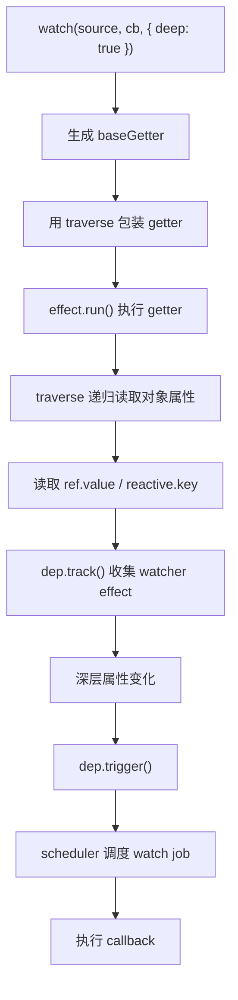
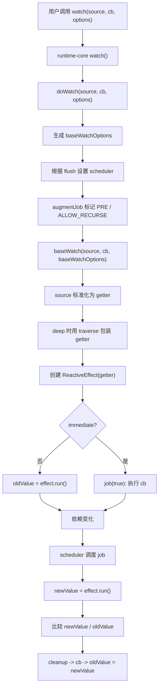
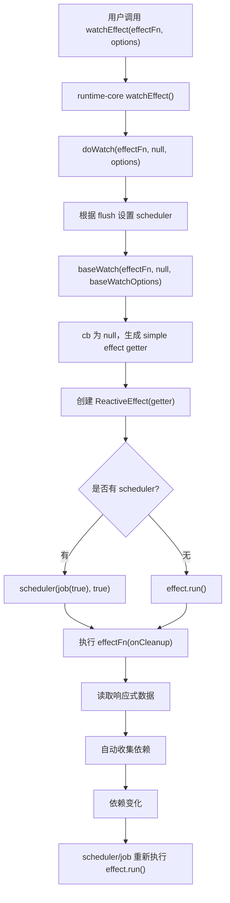

# Vue3 watch 与 watchEffect 源码实现深度分析

本文基于当前仓库 `vue3` 源码整理，重点分析 `watch`、`watchEffect` 的入口、调用链、`doWatch`、source 标准化、getter 生成、deep watch、scheduler、flush 时机、cleanup、oldValue/newValue，以及 `watchEffect` 为什么不需要显式指定监听源。

## 一、源码位置总览

| 能力 | 源码位置 | 作用 |
| --- | --- | --- |
| `watchEffect` 入口 | `vue3/packages/runtime-core/src/apiWatch.ts:56` | 公开 API，调用 `doWatch(effect, null, options)` |
| `watchPostEffect` 入口 | `vue3/packages/runtime-core/src/apiWatch.ts:63` | 等价于 `watchEffect` + `flush: 'post'` |
| `watchSyncEffect` 入口 | `vue3/packages/runtime-core/src/apiWatch.ts:76` | 等价于 `watchEffect` + `flush: 'sync'` |
| `watch` 入口 | `vue3/packages/runtime-core/src/apiWatch.ts:131` | 公开 API，调用 `doWatch(source, cb, options)` |
| runtime `doWatch` | `vue3/packages/runtime-core/src/apiWatch.ts:146` | 处理组件实例、SSR、flush scheduler，然后调用 reactivity 的基础 watch |
| base watch | `vue3/packages/reactivity/src/watch.ts:120` | 真正生成 getter、创建 `ReactiveEffect`、处理 old/new、cleanup |
| source 标准化 | `vue3/packages/reactivity/src/watch.ts:153` | 按 ref / reactive / array / function 生成 getter |
| deep traverse | `vue3/packages/reactivity/src/watch.ts:331` | 递归读取深层属性，借助读取触发依赖收集 |
| cleanup 注册 | `vue3/packages/reactivity/src/watch.ts:82`、`vue3/packages/reactivity/src/watch.ts:103` | `cleanupMap` 和 `onWatcherCleanup` |
| scheduler 队列 | `vue3/packages/runtime-core/src/scheduler.ts:99`、`vue3/packages/runtime-core/src/scheduler.ts:125` | `queueJob` 和 post flush 队列 |
| effect 执行与调度 | `vue3/packages/reactivity/src/effect.ts:162`、`vue3/packages/reactivity/src/effect.ts:206` | `ReactiveEffect.run()` 收集依赖，`trigger()` 调用 scheduler |

公开导出位置在 `runtime-core/src/index.ts`：

```ts
export {
  watch,
  watchEffect,
  watchPostEffect,
  watchSyncEffect,
} from './apiWatch'
```

## 二、watch 的入口在哪里？

`watch` 的公开入口在 `packages/runtime-core/src/apiWatch.ts`：

```ts
export function watch<T = any, Immediate extends Readonly<boolean> = false>(
  source: T | WatchSource<T>,
  cb: any,
  options?: WatchOptions<Immediate>,
): WatchHandle {
  if (__DEV__ && !isFunction(cb)) {
    warn(
      `watch(fn, options?) signature has been moved to a separate API. ` +
        `Use watchEffect(fn, options?) instead. watch now only ` +
        `supports watch(source, callback, options?) signature.`,
    )
  }
  return doWatch(source as any, cb, options)
}
```

调用链：

```text
watch(source, callback, options)
  -> runtime-core/apiWatch.ts: watch()
    -> doWatch(source, callback, options)
      -> 处理 flush / scheduler / 当前组件实例 / SSR
      -> baseWatch(source, callback, baseWatchOptions)
        -> reactivity/src/watch.ts: watch()
          -> 标准化 source，生成 getter
          -> 创建 ReactiveEffect(getter)
          -> 根据 immediate 决定初次执行方式
          -> 返回 watchHandle
```

这里有两层 `watch`：

1. `runtime-core/src/apiWatch.ts` 的 `watch` 是 Vue 运行时对外 API。
2. `reactivity/src/watch.ts` 的 `watch` 是基础实现，在 `apiWatch.ts` 中被重命名为 `baseWatch`。

## 三、watchEffect 的入口在哪里？

`watchEffect` 的入口在 `packages/runtime-core/src/apiWatch.ts`：

```ts
export function watchEffect(
  effect: WatchEffect,
  options?: WatchEffectOptions,
): WatchHandle {
  return doWatch(effect, null, options)
}
```

调用链：

```text
watchEffect(effect, options)
  -> runtime-core/apiWatch.ts: watchEffect()
    -> doWatch(effect, null, options)
      -> cb 为 null，表示 simple effect
      -> 处理 flush scheduler
      -> baseWatch(effect, null, baseWatchOptions)
        -> source 是函数，且 cb 不存在
        -> 生成 watchEffect 专用 getter
        -> new ReactiveEffect(getter)
        -> 初次立即执行 effect.run()
        -> effect 函数内部读取到的响应式数据自动成为依赖
```

`watchPostEffect` 和 `watchSyncEffect` 只是两个快捷 API：

```text
watchPostEffect(fn)
  -> doWatch(fn, null, { flush: 'post' })

watchSyncEffect(fn)
  -> doWatch(fn, null, { flush: 'sync' })
```

## 四、watch 和 watchEffect 的核心区别是什么？

| 对比项 | watch | watchEffect |
| --- | --- | --- |
| 调用形式 | `watch(source, callback, options)` | `watchEffect(effect, options)` |
| 是否显式 source | 需要 | 不需要 |
| callback | 有，接收 `newValue`、`oldValue`、`onCleanup` | effect 函数本身就是副作用，接收 `onCleanup` |
| 初次执行 | 默认先运行 getter 收集依赖并保存 oldValue，不执行 callback；`immediate: true` 才立即执行 callback | 默认立即执行 |
| 依赖来源 | 只追踪 source getter 中读取的依赖 | 自动追踪 effect 执行过程中读取的所有响应式依赖 |
| oldValue / newValue | 支持 | 不支持 |
| deep | 支持 `deep: true` 或数字深度 | 公开层会警告：无 callback 时 deep 不适用 |
| once | 支持有 callback 的 watch | 对 simple effect 忽略 |
| 典型用途 | 精确观察一个或多个源，然后执行副作用 | 自动收集依赖，适合“用到什么就监听什么”的副作用 |

一句话：

```text
watch = 显式指定监听源，然后在源变化后执行 callback
watchEffect = 直接执行副作用函数，并自动把函数里读取到的响应式数据作为监听源
```

## 五、doWatch 做了什么？

当前源码中，`doWatch` 位于 `runtime-core/src/apiWatch.ts`，它不是最终的响应式实现，而是运行时适配层。

核心职责：

1. 校验 `watchEffect` 场景下不适用的选项。
2. 复制 options，生成 `baseWatchOptions`。
3. 注入错误处理函数 `callWithAsyncErrorHandling`。
4. 根据 `flush` 生成 scheduler。
5. 给 job 打标，例如 `ALLOW_RECURSE`、`PRE`、组件 `uid`。
6. 处理 SSR 下的 watcher。
7. 调用 `baseWatch(source, cb, baseWatchOptions)`。

简化版逻辑：

```ts
function doWatch(source, cb, options = EMPTY_OBJ): WatchHandle {
  const { immediate, deep, flush, once } = options

  if (__DEV__ && !cb) {
    // watchEffect 下 immediate / deep / once 不适用，开发环境警告
  }

  const baseWatchOptions = extend({}, options)
  baseWatchOptions.call = (fn, type, args) =>
    callWithAsyncErrorHandling(fn, instance, type, args)

  if (flush === 'post') {
    baseWatchOptions.scheduler = job => {
      queuePostRenderEffect(job, instance && instance.suspense)
    }
  } else if (flush !== 'sync') {
    baseWatchOptions.scheduler = (job, isFirstRun) => {
      if (isFirstRun) {
        job()
      } else {
        queueJob(job)
      }
    }
  }

  baseWatchOptions.augmentJob = job => {
    if (cb) job.flags! |= SchedulerJobFlags.ALLOW_RECURSE
    if (isPre) {
      job.flags! |= SchedulerJobFlags.PRE
      if (instance) job.id = instance.uid
    }
  }

  return baseWatch(source, cb, baseWatchOptions)
}
```

可以理解为：

```text
runtime doWatch = 给基础 watch 接上组件调度系统、错误处理和 SSR 规则
baseWatch = 真正的响应式依赖追踪和回调执行
```

## 六、baseWatch 核心逻辑

`baseWatch` 对应 `packages/reactivity/src/watch.ts` 中导出的 `watch()`。

它做的事情可以分成 8 步：

```text
1. 解析 options：immediate / deep / once / scheduler / augmentJob / call
2. 根据 source 类型生成 getter
3. 如果 cb && deep，用 traverse 包装 getter
4. 创建 watchHandle，用于 stop
5. 如果 once && cb，包装 callback，使其执行一次后 stop
6. 初始化 oldValue
7. 创建 job：触发时运行 effect、比较新旧值、执行 cleanup 和 callback
8. 创建 ReactiveEffect(getter)，设置 scheduler，并执行初次收集
```

关键源码骨架：

```ts
export function watch(source, cb?, options = EMPTY_OBJ): WatchHandle {
  const { immediate, deep, once, scheduler, augmentJob, call } = options

  let effect: ReactiveEffect
  let getter: () => any
  let cleanup: (() => void) | undefined
  let boundCleanup: typeof onWatcherCleanup
  let forceTrigger = false
  let isMultiSource = false

  // 1. source -> getter

  // 2. deep 包装
  if (cb && deep) {
    const baseGetter = getter
    const depth = deep === true ? Infinity : deep
    getter = () => traverse(baseGetter(), depth)
  }

  // 3. job
  const job = (immediateFirstRun?: boolean) => {}

  // 4. 创建 effect
  effect = new ReactiveEffect(getter)
  effect.scheduler = scheduler
    ? () => scheduler(job, false)
    : (job as EffectScheduler)

  // 5. 初次执行
  if (cb) {
    if (immediate) job(true)
    else oldValue = effect.run()
  } else if (scheduler) {
    scheduler(job.bind(null, true), true)
  } else {
    effect.run()
  }

  return watchHandle
}
```

## 七、source 是如何标准化的？

`baseWatch` 会把不同类型的 source 统一转换成 getter。

### 1. ref / computed

```ts
if (isRef(source)) {
  getter = () => source.value
  forceTrigger = isShallow(source)
}
```

因为 computed 也是 ref，所以 `watch(computedValue, cb)` 也走这里。

### 2. reactive 对象

```ts
else if (isReactive(source)) {
  getter = () => reactiveGetter(source)
  forceTrigger = true
}
```

reactive 对象默认会通过 `reactiveGetter` 递归读取属性，从而收集深层依赖。

### 3. 数组 sources

```ts
else if (isArray(source)) {
  isMultiSource = true
  forceTrigger = source.some(s => isReactive(s) || isShallow(s))
  getter = () =>
    source.map(s => {
      if (isRef(s)) return s.value
      else if (isReactive(s)) return reactiveGetter(s)
      else if (isFunction(s)) return call ? call(s, WATCH_GETTER) : s()
      else warnInvalidSource(s)
    })
}
```

所以：

```ts
watch([count, () => state.name], ([newCount, newName], oldValues) => {})
```

会被标准化成一个返回数组的 getter。

### 4. 函数 source

函数 source 分两种情况。

有 callback 时，是普通 watch getter：

```ts
else if (isFunction(source)) {
  if (cb) {
    getter = call
      ? () => call(source, WatchErrorCodes.WATCH_GETTER)
      : source
  }
}
```

没有 callback 时，就是 watchEffect：

```ts
else if (isFunction(source)) {
  if (!cb) {
    getter = () => {
      if (cleanup) {
        pauseTracking()
        cleanup()
        resetTracking()
      }

      const currentEffect = activeWatcher
      activeWatcher = effect
      try {
        return call
          ? call(source, WatchErrorCodes.WATCH_CALLBACK, [boundCleanup])
          : source(boundCleanup)
      } finally {
        activeWatcher = currentEffect
      }
    }
  }
}
```

### 5. 无效 source

其他类型会生成空函数：

```ts
getter = NOOP
__DEV__ && warnInvalidSource(source)
```

## 八、getter 是如何生成的？

getter 的目的有两个：

1. 返回当前监听源的值，用于 `watch` 比较 oldValue/newValue。
2. 在 `ReactiveEffect.run()` 中执行，借助响应式 getter 自动收集依赖。

不同 source 的 getter：

| source 类型 | getter |
| --- | --- |
| `ref` / `computed` | `() => source.value` |
| `reactive` | `() => reactiveGetter(source)` |
| source 数组 | `() => source.map(normalizeOneSource)` |
| 函数 + callback | `() => source()` |
| 函数 + 无 callback | 包装成 watchEffect getter，执行副作用函数并传入 cleanup |
| 无效 source | `NOOP` |

重要的是：getter 并不手动调用 `track`。它只是读取响应式数据，真正的依赖收集发生在 `ReactiveEffect.run()` 中：

```text
effect.run()
  -> activeSub = effect
  -> shouldTrack = true
  -> 执行 getter()
  -> getter 内部读取 ref.value / reactive.property
  -> 对应 dep.track() 收集当前 effect
```

## 九、deep watch 是如何通过 traverse 实现的？

deep watch 的核心思想很朴素：递归读取对象里的每一层属性，让这些属性的 getter 都被访问一遍，从而完成依赖收集。

在 baseWatch 中：

```ts
if (cb && deep) {
  const baseGetter = getter
  const depth = deep === true ? Infinity : deep
  getter = () => traverse(baseGetter(), depth)
}
```

`traverse` 逻辑：

```ts
export function traverse(
  value: unknown,
  depth: number = Infinity,
  seen?: Map<unknown, number>,
): unknown {
  if (depth <= 0 || !isObject(value) || value[ReactiveFlags.SKIP]) {
    return value
  }

  seen = seen || new Map()
  if ((seen.get(value) || 0) >= depth) {
    return value
  }
  seen.set(value, depth)
  depth--

  if (isRef(value)) {
    traverse(value.value, depth, seen)
  } else if (isArray(value)) {
    for (let i = 0; i < value.length; i++) {
      traverse(value[i], depth, seen)
    }
  } else if (isSet(value) || isMap(value)) {
    value.forEach((v: any) => {
      traverse(v, depth, seen)
    })
  } else if (isPlainObject(value)) {
    for (const key in value) {
      traverse(value[key], depth, seen)
    }
    for (const key of Object.getOwnPropertySymbols(value)) {
      if (Object.prototype.propertyIsEnumerable.call(value, key)) {
        traverse(value[key as any], depth, seen)
      }
    }
  }
  return value
}
```

deep watch 流程：

```text
watch(obj, cb, { deep: true })
  -> base getter 得到 obj
  -> deep 包装：getter = () => traverse(obj, Infinity)
  -> effect.run()
    -> traverse 递归读取 obj.a、obj.a.b、数组元素、Map/Set 值、ref.value
    -> 每次读取 reactive 属性都会触发 track
  -> 深层属性变化时，对应 dep 触发 watcher job
```

Mermaid 流程图：



几个细节：

- `deep: true` 的深度是 `Infinity`。
- `deep: number` 会使用数字作为最大递归深度。
- `seen` 用来避免循环引用导致无限递归。
- 遇到 `ReactiveFlags.SKIP` 的对象会停止递归。
- 对 reactive object 作为 source 且没有显式 `deep` 时，`reactiveGetter` 默认也会 `traverse(source)`。

## 十、scheduler 在 watch 中起什么作用？

`scheduler` 决定依赖变化后 watcher 的 job 何时执行。

在 baseWatch 中：

```ts
effect = new ReactiveEffect(getter)

effect.scheduler = scheduler
  ? () => scheduler(job, false)
  : (job as EffectScheduler)
```

当依赖变化时：

```text
dep.trigger()
  -> effect.notify()
  -> effect.trigger()
    -> 如果 effect.scheduler 存在，调用 scheduler()
    -> 否则直接 runIfDirty()
```

对 watch 来说，`scheduler` 最终调度的是 `job`，而不是直接调度 getter。`job` 内部才负责：

1. 判断 effect 是否还 active。
2. 判断是否 dirty。
3. 执行 `effect.run()` 拿到 newValue。
4. 比较 newValue 和 oldValue。
5. 执行 cleanup。
6. 调用 callback。
7. 更新 oldValue。

runtime `doWatch` 根据 `flush` 创建 scheduler：

```ts
if (flush === 'post') {
  baseWatchOptions.scheduler = job => {
    queuePostRenderEffect(job, instance && instance.suspense)
  }
} else if (flush !== 'sync') {
  baseWatchOptions.scheduler = (job, isFirstRun) => {
    if (isFirstRun) {
      job()
    } else {
      queueJob(job)
    }
  }
}
```

`flush: 'sync'` 不设置 scheduler，baseWatch 会把 `job` 直接作为 `effect.scheduler`，因此触发时同步执行。

## 十一、flush: pre / post / sync 分别有什么区别？

| flush | scheduler | 执行时机 | 初次执行 | 常见用途 |
| --- | --- | --- | --- | --- |
| `pre` 默认 | `queueJob(job)` | 组件更新前的队列中执行；job 带 `PRE` 标记，并绑定组件 uid | `watchEffect` 首次同步执行；`watch` 非 immediate 只收集 oldValue | 默认选择，适合在 DOM 更新前响应状态变化 |
| `post` | `queuePostRenderEffect(job, suspense)` | 组件渲染和 DOM patch 后执行 | `watchEffect` 首次也走 post 队列 | 需要访问更新后的 DOM 时使用 |
| `sync` | 不额外排队，直接执行 job | 依赖触发时同步执行 | 立即同步执行 | 对时序要求极强、需要同步响应的场景，使用时要小心递归触发 |

`pre` 的 job 还会被打上调度标记：

```ts
if (isPre) {
  job.flags! |= SchedulerJobFlags.PRE
  if (instance) {
    job.id = instance.uid
    job.i = instance
  }
}
```

`watch(source, cb)` 的 job 还会被打上：

```ts
job.flags! |= SchedulerJobFlags.ALLOW_RECURSE
```

这是因为 watch callback 不会继续被追踪为依赖，允许它在明确场景下自触发，是否稳定由用户负责。

## 十二、cleanup 回调是如何实现的？

cleanup 的存储结构：

```ts
const cleanupMap: WeakMap<ReactiveEffect, (() => void)[]> = new WeakMap()
let activeWatcher: ReactiveEffect | undefined = undefined
```

注册入口：

```ts
export function onWatcherCleanup(
  cleanupFn: () => void,
  failSilently = false,
  owner: ReactiveEffect | undefined = activeWatcher,
): void {
  if (owner) {
    let cleanups = cleanupMap.get(owner)
    if (!cleanups) cleanupMap.set(owner, (cleanups = []))
    cleanups.push(cleanupFn)
  }
}
```

baseWatch 会创建一个绑定当前 effect 的 `boundCleanup`：

```ts
boundCleanup = fn => onWatcherCleanup(fn, false, effect)
```

然后在 callback 或 watchEffect 中传入它：

```text
watch(source, (newValue, oldValue, onCleanup) => {
  onCleanup(() => {})
})

watchEffect((onCleanup) => {
  onCleanup(() => {})
})
```

cleanup 的执行时机有两个：

### 1. 下一次重新执行前

watch callback 的 job 中：

```ts
if (cleanup) {
  cleanup()
}
```

watchEffect 的 getter 中：

```ts
if (cleanup) {
  pauseTracking()
  try {
    cleanup()
  } finally {
    resetTracking()
  }
}
```

watchEffect 执行 cleanup 时会暂停依赖追踪，避免 cleanup 自己读取响应式数据时把这些读取错误收集成依赖。

### 2. stop 时

baseWatch 设置：

```ts
cleanup = effect.onStop = () => {
  const cleanups = cleanupMap.get(effect)
  if (cleanups) {
    for (const cleanup of cleanups) cleanup()
    cleanupMap.delete(effect)
  }
}
```

当调用 stop handle：

```ts
const stop = watchEffect(() => {})
stop()
```

会执行：

```text
watchHandle()
  -> effect.stop()
    -> cleanupEffect(effect)
    -> effect.onStop()
      -> 执行 cleanupMap 中的 cleanup
```

## 十三、watch 如何拿到 oldValue 和 newValue？

`baseWatch` 用一个局部变量保存旧值：

```ts
let oldValue: any = isMultiSource
  ? new Array((source as []).length).fill(INITIAL_WATCHER_VALUE)
  : INITIAL_WATCHER_VALUE
```

### 1. 非 immediate watch

初始化时：

```ts
if (cb) {
  if (immediate) {
    job(true)
  } else {
    oldValue = effect.run()
  }
}
```

也就是说，非 immediate watch 创建时只执行 getter，收集依赖并保存 oldValue，不调用 callback。

依赖变化时 job 执行：

```ts
const newValue = effect.run()
if (
  deep ||
  forceTrigger ||
  hasChanged(newValue, oldValue)
) {
  if (cleanup) cleanup()
  const args = [
    newValue,
    oldValue === INITIAL_WATCHER_VALUE ? undefined : oldValue,
    boundCleanup,
  ]
  oldValue = newValue
  cb!(...args)
}
```

调用链：

```text
初次创建
  -> oldValue = effect.run()

依赖变化
  -> job()
    -> newValue = effect.run()
    -> hasChanged(newValue, oldValue)
    -> cb(newValue, oldValue, onCleanup)
    -> oldValue = newValue
```

### 2. immediate watch

`immediate: true` 时直接执行：

```ts
job(true)
```

由于 `oldValue` 还是 `INITIAL_WATCHER_VALUE`，所以第一次 callback 的 oldValue 会被转换成 `undefined`：

```ts
oldValue === INITIAL_WATCHER_VALUE ? undefined : oldValue
```

### 3. 多 source watch

数组 source 会让 getter 返回数组：

```ts
getter = () => source.map(...)
```

oldValue 初始化为同长度的 sentinel 数组：

```ts
new Array(source.length).fill(INITIAL_WATCHER_VALUE)
```

比较时：

```ts
newValue.some((v, i) => hasChanged(v, oldValue[i]))
```

第一次多 source callback 的 oldValue 会被处理成空数组：

```ts
isMultiSource && oldValue[0] === INITIAL_WATCHER_VALUE ? [] : oldValue
```

## 十四、watchEffect 为什么不需要显式指定监听源？

因为 `watchEffect` 把用户传入的 effect 函数本身包装成 getter，并放进 `ReactiveEffect` 中执行。

调用链：

```text
watchEffect(fn)
  -> doWatch(fn, null, options)
    -> baseWatch(fn, null, options)
      -> source 是函数，cb 为 null
      -> getter = () => fn(boundCleanup)
      -> effect = new ReactiveEffect(getter)
      -> effect.run()
        -> activeSub = effect
        -> 执行 fn()
        -> fn 内部读取的 ref/reactive 自动被 dep.track 收集
```

示例：

```ts
const count = ref(0)
const name = ref('Vue')

watchEffect(() => {
  console.log(count.value, name.value)
})
```

这里没有显式传入 `[count, name]`，但首次执行 effect 时读取了 `count.value` 和 `name.value`，它们的 dep 就会收集当前 watcher effect。因此后续任意一个变化都会重新调度这个 effect。

这也是 watchEffect 的特点：

```text
source 不是由调用者声明
source = effect 函数同步执行期间实际读取到的响应式依赖集合
```

## 十五、watch 调用链



## 十六、watchEffect 调用链



## 十七、flush 时机对比表

| 选项 | API | 首次执行 | 更新时执行 | 队列 | DOM 状态 |
| --- | --- | --- | --- | --- | --- |
| 默认 / `flush: 'pre'` | `watch` / `watchEffect` | `watchEffect` 首次同步；`watch` 默认只收集 oldValue | 进入 `queueJob`，带 `PRE` 标记 | 主 job 队列 | 组件 DOM 更新前 |
| `flush: 'post'` | `watchPostEffect` 或显式配置 | 进入 post 队列 | 进入 `queuePostRenderEffect` | post flush 队列 | 组件 DOM 更新后 |
| `flush: 'sync'` | `watchSyncEffect` 或显式配置 | 同步执行 | 依赖触发时同步执行 | 不经过 runtime 队列 | 当前调用栈内，可能早于组件批量更新 |

## 十八、watch 与 watchEffect 对比表

| 维度 | watch | watchEffect |
| --- | --- | --- |
| API 形态 | `watch(source, cb, options)` | `watchEffect(effect, options)` |
| source | 显式传入 | 自动收集 |
| callback 参数 | `newValue, oldValue, onCleanup` | `onCleanup` |
| 是否比较新旧值 | 是 | 否 |
| 初始执行 | 默认不执行 cb；`immediate` 才执行 | 默认立即执行 |
| deep | 支持 | 不适用 |
| cleanup | callback 第三个参数或 `onWatcherCleanup` | effect 参数或 `onWatcherCleanup` |
| 适合场景 | 精确监听某个源，关心新旧值 | 副作用中用到哪些响应式数据，就自动追踪哪些 |
| 实现核心 | getter 返回 source 值，job 比较并执行 cb | getter 直接执行 effect 函数 |

## 十九、示例代码

### 1. watch ref

```ts
import { ref, watch } from 'vue'

const count = ref(0)

watch(count, (newValue, oldValue) => {
  console.log(newValue, oldValue)
})

count.value++
// 输出：1, 0
```

### 2. watch getter

```ts
import { reactive, watch } from 'vue'

const state = reactive({
  user: {
    name: 'Ada',
  },
})

watch(
  () => state.user.name,
  (newName, oldName) => {
    console.log(newName, oldName)
  },
)

state.user.name = 'Grace'
```

### 3. watch 多个 source

```ts
import { ref, watch } from 'vue'

const firstName = ref('Ada')
const lastName = ref('Lovelace')

watch([firstName, lastName], ([newFirst, newLast], [oldFirst, oldLast]) => {
  console.log(newFirst, newLast, oldFirst, oldLast)
})
```

### 4. deep watch

```ts
import { reactive, watch } from 'vue'

const state = reactive({
  user: {
    profile: {
      name: 'Ada',
    },
  },
})

watch(
  state,
  () => {
    console.log('state changed')
  },
  { deep: true },
)

state.user.profile.name = 'Grace'
```

### 5. watchEffect 自动收集依赖

```ts
import { ref, watchEffect } from 'vue'

const count = ref(0)
const enabled = ref(true)

watchEffect(() => {
  if (enabled.value) {
    console.log(count.value)
  }
})

count.value++
enabled.value = false
```

首次执行时读取了 `enabled.value` 和 `count.value`，所以它们都会成为依赖。下一次如果 `enabled.value` 为 false，effect 不再读取 `count.value`，依赖清理后 `count` 可能不再触发它。

### 6. cleanup 取消异步请求

```ts
import { ref, watch } from 'vue'

const id = ref(1)

watch(id, async (newId, oldId, onCleanup) => {
  const controller = new AbortController()

  onCleanup(() => {
    controller.abort()
  })

  const res = await fetch(`/api/users/${newId}`, {
    signal: controller.signal,
  })

  console.log(await res.json())
})
```

当 `id` 再次变化时，上一次 callback 注册的 cleanup 会先执行，从而取消旧请求。

### 7. flush: post 访问更新后的 DOM

```ts
import { nextTick, ref, watch } from 'vue'

const visible = ref(false)

watch(
  visible,
  () => {
    const el = document.querySelector('#panel')
    console.log(el)
  },
  { flush: 'post' },
)

visible.value = true
await nextTick()
```

`flush: 'post'` 的 job 会进入 post render 队列，更适合读取更新后的 DOM。

## 二十、核心结论

1. `watch` 的公开入口在 `runtime-core/src/apiWatch.ts`，真正的基础实现是 `reactivity/src/watch.ts` 的 `watch`。
2. `watchEffect` 的入口是 `watchEffect(effect, options) -> doWatch(effect, null, options)`。
3. `doWatch` 是运行时适配层，负责 flush scheduler、组件实例、SSR、错误处理和 job 标记。
4. baseWatch 负责 source 标准化、getter 生成、deep traverse、创建 `ReactiveEffect`、old/new 比较、cleanup 和 stop handle。
5. `watch` 显式监听 source，callback 可拿到 `newValue` 和 `oldValue`。
6. `watchEffect` 不需要显式 source，因为它会自动追踪 effect 函数同步执行期间读取到的响应式依赖。
7. deep watch 通过 `traverse` 递归读取深层属性来完成依赖收集。
8. scheduler 决定 watcher job 的执行时机；`pre` 默认进入组件更新前队列，`post` 进入渲染后队列，`sync` 同步执行。
9. cleanup 通过 `cleanupMap: WeakMap<ReactiveEffect, cleanup[]>` 保存，并在重新执行前或 stop 时调用。
10. 如果你读源码，可以按顺序看：`runtime-core/src/apiWatch.ts` -> `reactivity/src/watch.ts` -> `reactivity/src/effect.ts` -> `runtime-core/src/scheduler.ts`。

